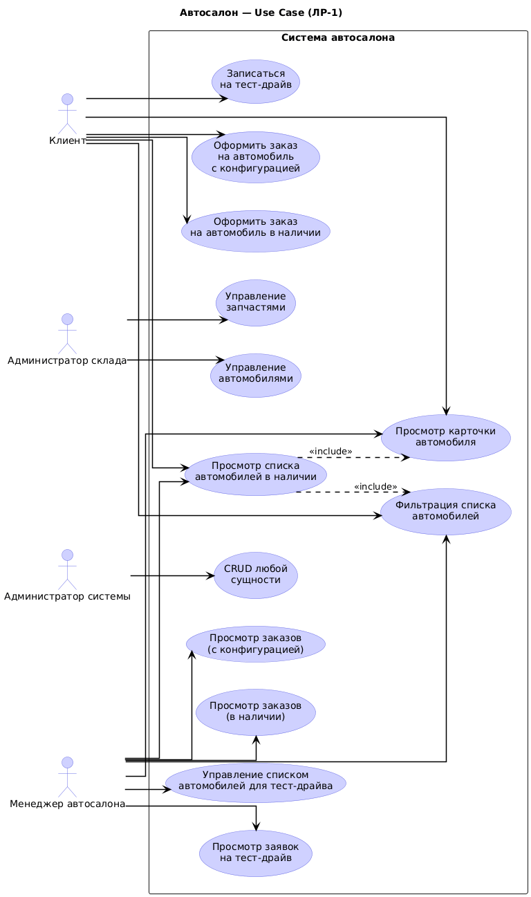
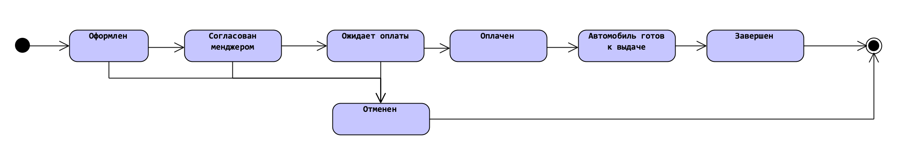
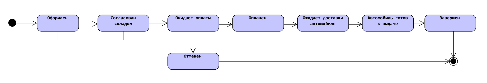

# Предисловие 🚘
В рамках лабораторных работ курса вам предстоит разработать информационную систему для мультибрендового, частного, 
(юридически не принадлежит ни одной автомобильной компании), автосалона с широким спектром услуг.
В этот проект вы будете постепенно добавлять новую функциональность и технологии.
И по выполнению всех лабораторных работ у вас получится back-end часть системы, которая должна вполне соответствовать современным тенденциям разработки ПО.

# Лабораторная работа 1

## Цель лабораторной работы:
- проверить соблюдение студентом принципов ООП;
- проверить освоение студентом языка программирования Java;
- проверить освоение студентом системы сборки Gradle.

## Задание
- спроектировать и разработать домен автосалона;
- реализовать конфигуратор автомобилей;
- настроить систему сборки.

## Описание системы
Пользователи:
- менеджер автосалона;
- администратор склада;
- клиент;
- администратор системы.

Сущности:
- автомобиль;
- запчасть;
- заказ на покупку автомобиля в наличии;
- заказ на автомобиль с определенной комплектацией;
- заявка на тест-драйв.

## Функциональные требования

### Пользователи системы и их сценарии использования системы

  
Use Case диаграмма

#### Клиент
Должен иметь возможность:
- просмотра конкретного автомобиля;
- просмотра списка доступных в наличии автомобилей;
- выставлять для демонстрируемого ему списка автомобилей следующие фильтры:
	- цена автомобиля;
    - бренд автомобиля;
	- модель автомобиля, (только при выбранном бренде);
	- кузов автомобиля: седан, универсал, купе и т.д.;
	- тип топлива двигателя: бензин, дизель, электричество;
	- мощность двигателя;
	- объем двигателя;
	- тип КПП, (коробка переключения передач): механическая, автоматическая;
	- привод автомобиля: передний, задний, полный;
	- цвет автомобиля.
- оформить заказ на покупку автомобиля в наличии;
- заказать автомобиль с определенной комплектацией;
- записаться на тест-драйв автомобиля.

#### Менеджер автосалона
Должен иметь возможность:
- просмотра конкретного автомобиля;
- просмотра списка доступных в наличии автомобилей;
- выставлять для демонстрируемого ему списка автомобилей следующие фильтры:
	- цена автомобиля;
    - бренд автомобиля;
	- модель автомобиля, (только при выбранном бренде);
	- кузов автомобиля: седан, универсал, купе и т.д.;
	- тип топлива двигателя: бензин, дизель, электричество;
	- мощность двигателя;
	- объем двигателя;
	- тип КПП, (коробка переключения передач): механическая, автоматическая;
	- привод автомобиля: передний, задний, полный;
	- цвет автомобиля.
- просмотра заказов на покупку автомобилей в наличии;
- просмотра заказов на покупку автомобилей с определенной комплектацией;
- добавлять и удалять автомобили из списка автомобилей для тест-драйва;
- просмотра заявок на тест-драйв.

#### Администратор склада
Должен иметь возможность:
- вносить новые автомобили и запчасти в систему;
- просматривать список автомобилей и запчастей;
- просмотра конкретного автомобиля или запчасти;
- менять информацию об автомобилях и о запчастях;

#### Администратор системы
Должен иметь возможность:
- просматривать, создавать, редактировать и удалять любую сущность.

### Внутренние процессы и особенности сущностей.
#### Заказ на покупку автомобиля в наличии
1. Должен быть связан с:
   - клиентом, совершившим заказ;
   - менеджером автосалона, работающим над заказом. Назначается автоматически (произвольным образом);
   - автомобилем, который заказали.

2. Должен иметь следующие статусы: 
   - оформлен;
   - согласован менеджером;
   - ожидает оплаты;
   - оплачен;
   - автомобиль готов к выдаче;
   - завершен;
   - отменен.

#### Заказ на покупку автомобиля с определенной комплектацией
1. Должен быть связан с:
   - клиентом, совершившим заказ;
   - менеджером автосалона, работающим над заказом. Назначается автоматически (произвольным образом);
   - автомобилем, который заказали (модель + конфигурация).

2. Должен иметь следующие статусы:
   - оформлен;
   - согласован складом;
   - ожидает оплаты;
   - оплачен;
   - ожидает доставки автомобиля;
   - автомобиль готов к выдаче;
   - завершен;
   - отменен.

#### Заявка на тест-драйв
1. Должна быть связана с:
   - клиентом, оформившим заявку;
   - автомобилем, на который оформлена заявка;
   - дата и время начала тест-драйва.

#### Запчасть
1. Может подходить к разным автомобилям.

---

#### Заказ автомобиля с определенной комплектацией

Каждая модель автомобиля имеет базовую комплектацию, то есть для каждой модели есть стандартные колеса, руль, интерьер салона, набор функций и т.д.,  
которые будут установлены в авто при его покупке по базовой стоимости.

Комплектацию можно поменять и заменить базовые элементы автомобиля на те,  
которые больше подходят конкретному покупателю.

По сути, *комплектация — это список крупных узлов интерьера, экстерьера или технической части,  
которые могут быть заменены на отличные от базовых в определенной модели автомобиля.*

При этом не любой узел можно поставить на любой автомобиль.  
Например: ~~на Lada нельзя поставить диски от BMW~~, **(можно)**, но автосалонам нельзя.

Совместимость узлов определяется бизнес-правилами автосалона  
и не обязана совпадать с физической возможностью установки компонента.

Необходимо реализовать для каждого **варианта узла**  
ограниченное количество **моделей автомобилей**,  
с которыми он совместим.

Каждый вариант узла имеет список **конкретных моделей автомобилей**,  
с которыми он совместим  
(например: BMW 320i, BMW 330i).

**Необходимо предоставить возможность пользователю собрать комплектацию автомобиля,  
с возможностью выбрать вариант исполнения каждого узла  
и посчитать стоимость итоговой комплектации.**

Итоговая стоимость конфигурации =  
базовая стоимость модели автомобиля + сумма доплат выбранных вариантов узлов.

---

### Пример работы конфигуратора (модель BMW 320i)

В системе поддерживается модель **BMW 320i**,  
для которой определён набор основных узлов:  
- колёса
- трансмиссия
- руль
- интерьер салона.

Каждый узел имеет базовый вариант и набор допустимых альтернатив.  
Совместимость каждого варианта узла определяется **конкретными моделями автомобилей**.

#### Базовая комплектация BMW 320i

| Узел        | Базовый вариант               | Доплата | Совместимые модели |
|-------------|-------------------------------|---------|--------------------|
| Колеса      | 17’’ Standard                 | 0 ₽     | BMW 320i           |
| Трансмиссия | Автоматическая 8AT            | 0 ₽     | BMW 320i, BMW 330i |
| Руль        | Спортивный кожаный (Standard) | 0 ₽     | BMW 320i, BMW 330i |
| Интерьер    | Тканевый Graphite             | 0 ₽     | BMW 320i           |

#### Доступные варианты узлов

| Узел        | Вариант                | Доплата    | Совместимые модели              |
|-------------|------------------------|------------|---------------------------------|
| Колеса      | 19’’ M-Sport           | +95 000 ₽  | BMW 320i, BMW 330i, BMW M340i   |
| Колеса      | 18’’ Aero              | +45 000 ₽  | BMW 320i, BMW 330i              |
| Трансмиссия | Механическая 6MT       | −30 000 ₽  | BMW 320i, BMW 330i              |
| Руль        | M-Sport с подогревом   | +25 000 ₽  | BMW 320i, BMW 330i, BMW M340i   |
| Интерьер    | Кожаный Dakota         | +110 000 ₽ | BMW 320i, BMW 330i              |
| Интерьер    | Спортивный Performance | +160 000 ₽ | BMW 330i, BMW M340i             |

---

### Сценарии работы конфигуратора

#### Корректная конфигурация

Клиент выбирает:
* Колёса: 19’’ M-Sport
* Трансмиссия: Автоматическая 8AT
* Руль: M-Sport с подогревом
* Интерьер: Кожаный Dakota

Все выбранные компоненты совместимы с BMW 320i.  
Конфигурация считается корректной.

Доплата:  
95 000 + 25 000 + 110 000 = **230 000 ₽**

Система формирует валидную конфигурацию  
и вычисляет итоговую стоимость.

---

#### Ошибка совместимости

Клиент выбирает:
* Интерьер: Спортивный Performance

Проверка:  
Интерьер Performance совместим только с моделями  
BMW 330i и BMW M340i  
и не включён в список совместимых для BMW 320i.

Система отклоняет выбор и сообщает:

> IncompatibleComponentException: выбранный интерьер недоступен для модели BMW 320i.

---

#### Ошибка отсутствия обязательного узла

Если пользователь не выбирает вариант хотя бы одного узла  
(например, не указывает интерьер),  
конфигуратор прекращает сборку и сообщает:

> DomainValidationException: отсутствует обязательный узел «Интерьер салона».

---

## Нефункциональные требования
- кодовая база должна быть реализована в трехслойной архитектуре;
- реализовать хранилище данных в виде репозитория, (in memory). Без подключения БД, использовать стандартные коллекции: Map, List, Set и др.
- обеспечить валидацию входных данных и совместимость компонентов. При нарушении — бросать предметные исключения (DomainValidationException, IncompatibleComponentException, EntityNotFoundException);
- везде, где возможно использовать StreamAPI и лямбда выражений;
- собирать и запускать через Docker-образ;
- обеспечить покрытие unit-тестами более 70%;
- системой сборки: Gradle.

*P.S. В этой лабораторной слой представления будет просто вызывать методы бизнес слоя. Дополнять слой представления вы будете в следующих лабораторных.*

### Задачи лабораторной работы:
Реализовать систему, в которой будут соблюдены все функциональные и нефункциональные требования,  
(сущности необходимо спроектировать самостоятельно на основе сценариев использования системы пользователями, внутренних процессов и особенностей сущностей).
